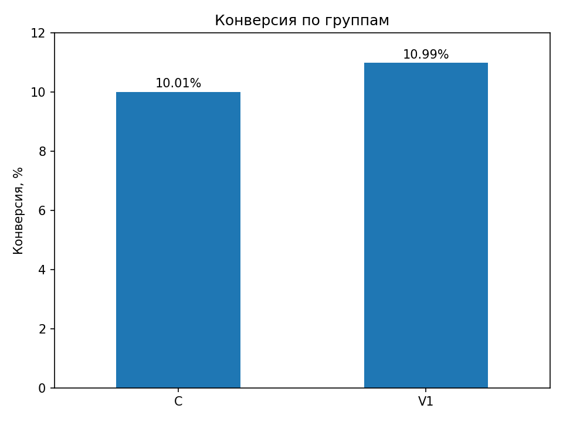
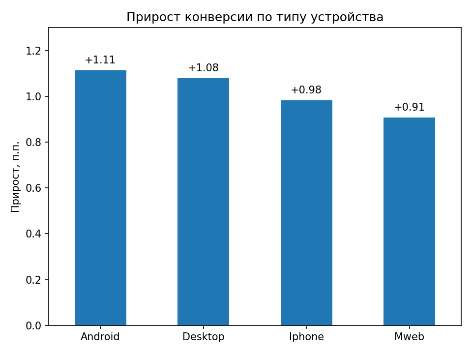

# A/B-тест новой версии e-commerce сайта

Анализ результатов A/B-теста новой версии сайта интернет-магазина. Основная метрика эксперимента — конверсия в покупку.

В эксперименте участвовало **2 млн наблюдений**, поровну распределённых между контрольной группой C и тестовой V1.

## Данные

В анализе используется открытый датасет с результатами A/B-теста e-commerce сайта.

Датасет содержит **2 000 000 наблюдений** и информацию о группе эксперимента, конверсии, типе устройства, источнике трафика, регионе и других характеристиках пользователя.

**Источник:** [(https://www.kaggle.com/datasets/surajatiitb/ecommerce-conversion-ab-test-data?utm_source=chatgpt.com)]

Исходный CSV не хранится в репозитории из-за размера файла.

## Результат

Новая версия показала рост конверсии:

| Метрика | C | V1 |
|---|---:|---:|
| Наблюдения | 1 000 000 | 1 000 000 |
| Конверсии | 100 092 | 109 884 |
| Conversion Rate | 10,01% | 10,99% |

**Абсолютный uplift:** +0,98 п.п.  
**Относительный uplift:** +9,78%

Разница между группами статистически значима: **p-value < 0,001**.  
95% доверительный интервал для разницы конверсий: **[0,89; 1,06] п.п.**



## Проверка статистической значимости

Для сравнения конверсий использован **two-proportion z-test**.

**H₀:** конверсия в группах C и V1 не различается.  
**H₁:** конверсия в группах C и V1 различается.

Уровень значимости: **α = 0,05**.

Полученное p-value < 0,001, поэтому H₀ отвергается. Разница между контрольной и тестовой группами статистически значима.

Помимо p-value рассчитан **95% доверительный интервал** для размера эффекта. Интервал **[0,89; 1,06] п.п.** полностью находится выше нуля и согласуется с результатом статистического теста.

## Сегментный анализ

Устойчивость эффекта дополнительно проверена по типу устройства и статусу пользователя.

### Тип устройства

| Устройство | C | V1 | Uplift |
|---|---:|---:|---:|
| Android | 10,06% | 11,17% | +1,11 п.п. |
| Desktop | 9,94% | 11,02% | +1,08 п.п. |
| iPhone | 10,01% | 10,99% | +0,98 п.п. |
| Mweb | 10,03% | 10,94% | +0,91 п.п. |

Положительный эффект наблюдается на всех типах устройств. Наибольший прирост получен для Android и Desktop, наименьший — для Mweb.



### Новые и вернувшиеся пользователи

Наблюдаемый эффект практически одинаков для обеих групп:

- новые пользователи: **+0,97 п.п.**
- вернувшиеся пользователи: **+0,99 п.п.**

Таким образом, общий рост конверсии не объясняется только одним пользовательским сегментом.

## Продуктовый вывод

V1 увеличила основную метрику эксперимента с **10,01% до 10,99%**: абсолютный прирост составил **+0,98 п.п.**, относительный — **+9,78%**.

Эффект статистически значим и сохраняет положительное направление в рассмотренных пользовательских сегментах.

При принятии решения о внедрении V1 необходимо учитывать не только рост основной метрики, но и **guardrail-метрики**. В датасете отсутствуют данные о выручке, отказах, скорости загрузки и других показателях, по которым можно было бы проверить возможные негативные последствия изменения.

## Ограничения

В данных отсутствует `user_id`, поэтому невозможно проверить уникальность пользователей и корректность распределения наблюдений между C и V1 на уровне пользователя.

Также отсутствуют дополнительные продуктовые и guardrail-метрики. Поэтому результат позволяет оценить влияние V1 на конверсию, но не даёт полной картины влияния изменения на продукт.

## Что использовано в анализе

- расчёт основной продуктовой метрики — **Conversion Rate**
- **absolute uplift** и **relative uplift**
- формулировка **H₀ / H₁**
- **two-proportion z-test**
- интерпретация **p-value**
- **95% доверительный интервал**
- сегментный анализ
- интерпретация результатов эксперимента
- анализ ограничений данных и **guardrail-метрик**

**Стек:** Python, Pandas, Statsmodels, Matplotlib, Jupyter Notebook.

## Структура проекта

```text
ab-test-ecommerce-analysis/
├── data/
├── images/
│   ├── conversion_by_group.png
│   └── uplift_by_device.png
├── notebooks/
│   └── ab_test_analysis.ipynb
├── .gitignore
└── README.md
```

Подробный анализ, статистические расчёты и код — в [`ab_test_analysis.ipynb`](notebooks/ab_test_analysis.ipynb).
